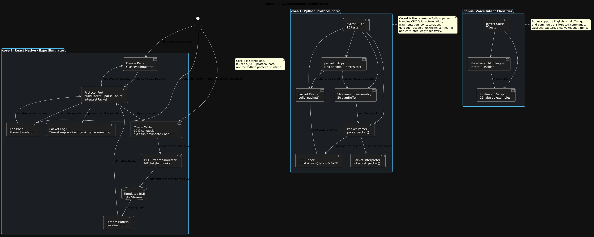

# GlassLink G1 Smart Glasses Simulator


I built a defensive parser for the fictional GlassLink G1 BLE protocol, a React Native/Expo simulator for both sides of the connection, and a bonus multilingual voice intent classifier.

## Repository Structure

```text
core-1/   Python protocol parser, streaming reassembly buffer, pytest tests
core-2/   React Native / Expo simulator UI
bonus/    Option B voice intent classifier and one-page design doc
```

## System Architecture



The React Native simulator is standalone and uses a JavaScript/TypeScript port of the protocol logic. The Python core is the reference parser with tests and stress tooling, while the bonus classifier is an independent voice-intent prototype.

## Features

- **Protocol parser and builder:** Builds and parses GlassLink G1 packets with direction headers, big-endian length fields, command bytes, payload bytes, and CRC validation.

- **Streaming reassembly buffer:** Handles fragmented BLE-style packets, concatenated packets, garbage bytes before headers, truncated input, and corrupted length fields without crashing.

- **Human-readable packet interpretation:** Converts supported commands into readable events such as LED brightness changes, battery updates, charging status, photo capture, action sync, and phone time sync.

- **React Native simulator UI:** Simulates both sides of the connection with a glasses/device panel and phone/app panel.

- **Live packet log:** Displays timestamped packet traffic with direction, parsed meaning, and raw hex dump.

- **Chaos mode:** Randomly corrupts around 10% of outgoing packets using byte flip, truncation, or bad CRC to test parser resilience.

- **Protocol lab tools:** Includes `packet_lab.py` for decoding pasted hex streams and running deterministic noisy-stream stress tests.

- **Bonus voice intent classifier:** Classifies English, Hindi, Telugu, and transliterated voice commands into `capture`, `exit`, `wake`, `chat`, or `none`.

- **Measurable bonus evaluation:** Includes a small labeled evaluation script for the classifier and pytest coverage for parser and bonus logic.

- **Documented assumptions:** README explains protocol assumptions, trade-offs, edge-case handling, and future improvements.


## Quick Start

### Core 1: Protocol Parser

```bash
cd core-1
python -m pytest -p no:cacheprovider
```

Optional manual demo:

```bash
python protocol.py
```

Extra protocol lab tools:

```bash
python packet_lab.py decode "AB 55 00 03 01 32 33"
python packet_lab.py stress --count 200 --seed 7
```

`packet_lab.py` is an initiative add-on: it decodes pasted hex streams and runs a deterministic noisy-stream simulation with fragmentation, corruption, dropped packet counting, and delivery-rate reporting.

### Core 2: Live Simulator

```bash
cd core-2
npm install
npm run web
```

The simulator runs in Expo and shows:

- Device panel for glasses-side events: photo, nod, shake, mic, music, battery, charging, worn state.
- App panel for phone-side commands: set LED, take photo, take photo with HD upload, sync time, request battery.
- Packet log with timestamp, direction, parsed meaning, and raw hex.
- Chaos mode that corrupts about 10% of outgoing packets using byte flip, truncation, or bad CRC.
- Stream buffers on both directions to model fragmented and concatenated BLE notifications.

### Bonus: Voice Intent Classifier

```bash
cd bonus
python classifier.py "take a photo of the board"
python classifier.py "jago glass"
python classifier.py "emi idi cheppu"
python evaluate_classifier.py
python -m pytest -p no:cacheprovider
```

The classifier returns one of `capture`, `exit`, `wake`, `chat`, or `none`. It supports English, Hindi, Telugu, and common transliterated phrases so it still works when a speech-to-text system outputs Roman text.

## Packet Protocol

Each packet follows:

```text
Header(2) | Length(2 big-endian) | Command(1) | Data(N) | CRC(1)
```

Headers:

- `AB 55`: app to device
- `AC 55`: device to app

Length covers:

```text
command byte + data bytes + CRC byte
```

CRC:

```text
(cmd + sum(data)) & 0xFF
```

Implemented commands:

| Cmd | Meaning | Data |
| --- | --- | --- |
| `0x01` | Set LED brightness | `0x30` low, `0x31` medium, `0x32` high |
| `0x17` | Get battery / battery reply | reply: `[level%, charging_status]` |
| `0x22` | Take photo | `0x30` photo only, `0x31` photo + HD upload |
| `0x45` | Action sync | 9 flags: photo, recording, mic, vol+, vol-, nod, shake, music, worn |
| `0x53` | Charging status | `[charging flag, level%]` |
| `0x59` | Sync phone time | `[year_hi, year_lo, month, day, hour, min, sec]` |

## Edge Cases Handled

- Bad CRC: `parse_packet` returns `None`; `StreamBuffer` counts the dropped packet and continues scanning.
- Truncated packet: parser returns `None`; stream buffer keeps partial bytes until more data arrives.
- Concatenated packets: `StreamBuffer.feed()` returns all complete packets in order.
- Fragmented packets: partial bytes stay buffered across calls.
- Garbage before header: skipped until a valid header is found.
- Unknown command: parsed safely and interpreted as unknown.
- Zero-length command payload: encoded as zero data bytes. The parser still tolerates `0x00` as a request marker because the assignment wording is ambiguous.
- Invalid declared length: rejected without throwing.
- Unrealistic length after byte corruption: stream buffer drops/resynchronizes instead of waiting forever.

## Assumptions

- The assignment says "Data N bytes", mentions "`0x00` if empty", and separately asks for zero-length payload edge cases. I chose true zero-length payloads for request packets because the length field already identifies command + CRC. Example: Get Battery request is `AB 55 00 02 17 17`. The parser/interpreter also tolerates `AB 55 00 03 17 00 17` as the same request.
- A single `parse_packet(raw)` call expects exactly one complete packet. Multiple packets and partial packets are handled by `StreamBuffer`, because that matches how BLE notifications arrive in real applications.
- Bad CRC is considered a parse failure in the Python core. The simulator still logs invalid packets on the UI side so chaos mode visibly demonstrates graceful failure.
- I simulated BLE MTU as 20 bytes in the UI, the common minimum ATT payload size, to demonstrate fragmentation without needing real hardware.
- I cap Python stream-buffer packet size at 64 bytes. The current command table is much smaller than that; this guard is only to recover from corrupted length bytes.
- Unknown commands should never crash the parser or UI. They are displayed as unknown with raw data.

## Testing

Core parser tests cover:

- Valid build/parse round trip.
- CRC corruption.
- Truncated input.
- Extra bytes after a packet.
- Concatenated packets.
- Fragmented packets.
- Garbage before a header.
- Recovery after a corrupt packet.
- Zero-length payload.
- Unknown command.
- Device-to-app direction.
- Invalid builder arguments.
- Hex stream decoding via `packet_lab.py`.
- Deterministic noisy-stream stress simulation.

Bonus tests cover English, Hindi, Telugu, transliterated phrases, exit, `none`, and a small labeled evaluation set.

## Design Trade-offs

I kept Core 1 in Python because the approved exception allowed it and Python makes byte-level tests compact. The simulator ports the same protocol logic into React Native so the UI can run standalone in Expo without a backend.

The bonus classifier is rule-based instead of ML-based. That is intentional for this assignment: it runs offline, has no model download, and is easy to explain. I also added `evaluate_classifier.py` as a tiny measurable baseline before any model work. With more time I would collect sample ASR transcripts and compare this baseline against a small multilingual embedding model.

## What I Would Improve With More Time

- Split the large `App.tsx` simulator into separate protocol, stream buffer, chaos, and component files.
- Add Jest tests for the React Native protocol port.
- Extend `packet_lab.py` into a replay mode that imports saved BLE traces from files.
- Add screen recording to the repository after final UI verification.
- Expand the voice classifier with a larger labeled phrase dataset and confusion matrix.
